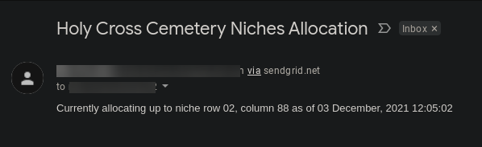

# Niche Notifier
Scrap niche allocation site and send email on row and column info
https://vgoffice.catholic.org.hk/cemetery/niche_eng.aspx

Email Example


## How to use
Secret is hard coded right now

### Install dependencies
Install following python 3 packages gloablly with `pip3 install <package_name>`
- requests
- bs4
- pytz

### Get Sendgrid API key

Follow the sendgrid documentation to create an api key
https://docs.sendgrid.com/ui/account-and-settings/api-keys

Do `cp config.py.example config.py`

Paste in the api key.

### Set your sender and receiver email

### Create a log file
You could create the log file wherever you want. I created my in the same directory.

### set up cron job
`crontab -e`
set cron time based on local time
The information updates Monday to Saturday at noon and 4:30pm HKT. Adjust your cron job timing based on your server's timezone. The 4:30pm updates are usually late from my experience.

e.g. EST server where cron job runs at 0004 and 0523.  That's why I set it to 5:23pm.
```bash
5 23 * * * python3 <path/to/niche-notifier.py> >> <path/to/log_file.log> 2>&1
0 4 * * * python3 <path/to/niche-notifier.py> >> <path/to/log_file.log> 2>&1
```
